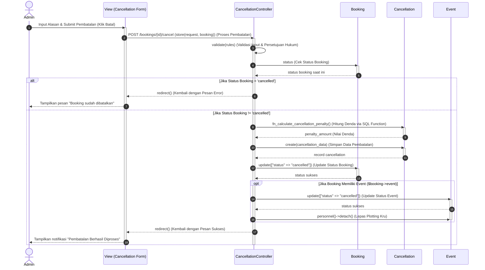

# Sequence Diagram: Kelola Cancellation (Pembatalan Booking)

Berikut adalah *Sequence Diagram* untuk **Aktivitas 13: Kelola Cancellation** yang disusun secara presisi berdasarkan alur kode PHP pada [CancellationController.php](file:///d:/ART-HUB_Sanggar Seni/laravel-app-2/app/Http/Controllers/Admin/CancellationController.php#L27), disederhanakan hanya menggunakan objek **View, Controller, dan Model** (tanpa kelas DB Query Builder/FileSystem eksternal).

---

## 1. Diagram (Mermaid)



---

## 2. Keterangan Setiap Garis (Untuk Salin-Tempel ke StarUML)

Berikut adalah daftar teks keterangan garis yang bisa Kakak salin langsung ke StarUML:

### A. Alur Awal & Validasi
1. **Admin $\rightarrow$ View (Cancellation Form)**
   * Tipe: Sinkron
   * Teks: `Input Alasan & Submit Pembatalan (Klik Batal)`
2. **View (Cancellation Form) $\rightarrow$ CancellationController**
   * Tipe: Sinkron
   * Teks: `POST /bookings/{id}/cancel (store(request, booking)) (Proses Pembatalan)`
3. **CancellationController $\rightarrow$ CancellationController (Self)**
   * Tipe: Mandiri
   * Teks: `validate(rules) (Validasi Input & Persetujuan Hukum)`
4. **CancellationController $\rightarrow$ Booking (Model)**
   * Tipe: Sinkron
   * Teks: `status (Cek Status Booking)`
5. **Booking (Model) $\rightarrow$ CancellationController**
   * Tipe: Balasan
   * Teks: `status booking saat ini`

### B. Cabang 1: Jika Status Booking = 'cancelled' (Kotak `alt` Atas)
6. **CancellationController $\rightarrow$ View (Cancellation Form)**
   * Tipe: Balasan
   * Teks: `redirect() (Kembali dengan Pesan Error)`
7. **View (Cancellation Form) $\rightarrow$ Admin**
   * Tipe: Balasan
   * Teks: `Tampilkan pesan "Booking sudah dibatalkan"`

### C. Cabang 2: Jika Status Booking != 'cancelled' (Kotak `alt` Bawah)
8. **CancellationController $\rightarrow$ Cancellation (Model)**
   * Tipe: Sinkron
   * Teks: `fn_calculate_cancellation_penalty() (Hitung Denda via SQL Function)`
9. **Cancellation (Model) $\rightarrow$ CancellationController**
   * Tipe: Balasan
   * Teks: `penalty_amount (Nilai Denda)`
10. **CancellationController $\rightarrow$ Cancellation (Model)**
    * Tipe: Sinkron
    * Teks: `create(cancellation_data) (Simpan Data Pembatalan)`
11. **Cancellation (Model) $\rightarrow$ CancellationController**
    * Tipe: Balasan
    * Teks: `record cancellation`
12. **CancellationController $\rightarrow$ Booking (Model)**
    * Tipe: Sinkron
    * Teks: `update(["status" => "cancelled"]) (Update Status Booking)`
13. **Booking (Model) $\rightarrow$ CancellationController**
    * Tipe: Balasan
    * Teks: `status sukses`

### D. Di dalam Cabang 2 (Kotak `opt` - Jika Ada Event Terikat)
14. **CancellationController $\rightarrow$ Event (Model)**
    * Tipe: Sinkron
    * Teks: `update(["status" => "cancelled"]) (Update Status Event)`
15. **Event (Model) $\rightarrow$ CancellationController**
    * Tipe: Balasan
    * Teks: `status sukses`
16. **CancellationController $\rightarrow$ Event (Model)**
    * Tipe: Sinkron
    * Teks: `personnel()->detach() (Lepas Plotting Kru)`

### E. Akhir & Redirect Sukses
17. **CancellationController $\rightarrow$ View (Cancellation Form)**
    * Tipe: Balasan
    * Teks: `redirect() (Kembali dengan Pesan Sukses)`
18. **View (Cancellation Form) $\rightarrow$ Admin**
    * Tipe: Balasan
    * Teks: `Tampilkan notifikasi "Pembatalan Berhasil Diproses"`

---

## 3. Pemetaan Kode PHP Ke Diagram Sequence

Diagram ini memetakan kode di **`CancellationController.php`** baris **27 s.d. 96** sebagai berikut:

* **Langkah 3 (Validasi)** memetakan baris 29–32:
  ```php
  $request->validate([
      'reason' => 'required|string',
      'digital_acknowledgement' => 'required|boolean|accepted',
  ]);
  ```
* **Langkah 4 (Cek Batal)** memetakan baris 34–36:
  ```php
  if ($booking->status === 'cancelled') {
      return redirect()->back()->with('error', 'Booking sudah dibatalkan sebelumnya.');
  }
  ```
* **Langkah 8 (SQL Function Denda)** memetakan baris 46–50 (dipanggil lewat Model/Database):
  ```php
  $query = DB::select('SELECT fn_calculate_cancellation_penalty(?, ?, ?) AS penalty_amount', [
      $eventDate,
      $cancelDate,
      $booking->total_price
  ]);
  ```
* **Langkah 10 (Simpan Cancellation)** memetakan baris 67–80:
  ```php
  Cancellation::create([ ... ]);
  ```
* **Langkah 12 (Update Booking)** memetakan baris 83:
  ```php
  $booking->update(['status' => 'cancelled']);
  ```
* **Langkah 14 s.d 16 (Update Event & Detach Kru)** memetakan baris 84–88:
  ```php
  if ($booking->event) {
      $booking->event->update(['status' => 'cancelled']);
      $booking->event->personnel()->detach(); 
  }
  ```
