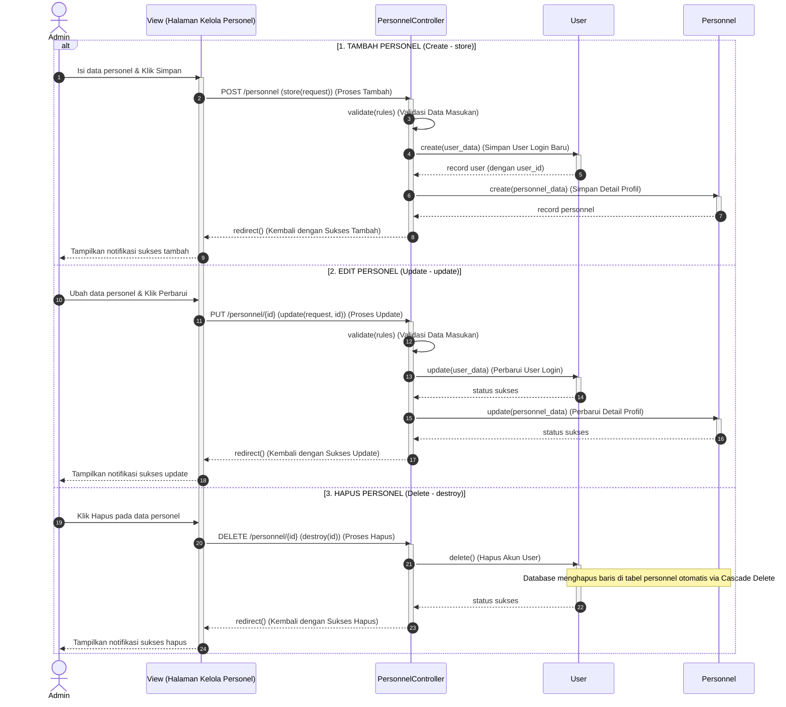

# Sequence Diagram: Kelola Personnel (CRUD Lengkap) (Aktivitas 6)

Berikut adalah **Sequence Diagram Induk** untuk **Aktivitas 6: Kelola Personnel** yang mencakup seluruh operasi **CRUD (Create, Update, Delete)** dalam satu diagram terpadu menggunakan bingkai **ALT** sesuai dengan kode asli pada [PersonnelController.php](file:///d:/ART-HUB_Sanggar Seni/laravel-app-2/app/Http/Controllers/Admin/PersonnelController.php).

---

## 1. Diagram (Mermaid)



---

## 2. Keterangan Setiap Garis (Untuk Salin-Tempel ke StarUML)

Berikut adalah daftar teks garis untuk disalin langsung ke StarUML:

### Bagian 1: TAMBAH PERSONEL (Kotak `alt` Pertama)
1. **Admin $\rightarrow$ View (Halaman Kelola Personel)** $\rightarrow$ `Isi data personel & Klik Simpan`
2. **View (Halaman Kelola Personel) $\rightarrow$ PersonnelController** $\rightarrow$ `POST /personnel (store(request)) (Proses Tambah)`
3. **PersonnelController $\rightarrow$ PersonnelController (Self)** $\rightarrow$ `validate(rules) (Validasi Data Masukan)`
4. **PersonnelController $\rightarrow$ User (Model)** $\rightarrow$ `create(user_data) (Simpan User Login Baru)`
5. **User (Model) $\rightarrow$ PersonnelController** $\rightarrow$ `record user (dengan user_id)`
6. **PersonnelController $\rightarrow$ Personnel (Model)** $\rightarrow$ `create(personnel_data) (Simpan Detail Profil)`
7. **Personnel (Model) $\rightarrow$ PersonnelController** $\rightarrow$ `record personnel`
8. **PersonnelController $\rightarrow$ View (Halaman Kelola Personel)** $\rightarrow$ `redirect() (Kembali dengan Sukses Tambah)`
9. **View (Halaman Kelola Personel) $\rightarrow$ Admin** $\rightarrow$ `Tampilkan notifikasi sukses tambah`

### Bagian 2: EDIT PERSONEL (Kotak `alt` Kedua / `else`)
10. **Admin $\rightarrow$ View (Halaman Kelola Personel)** $\rightarrow$ `Ubah data personel & Klik Perbarui`
11. **View (Halaman Kelola Personel) $\rightarrow$ PersonnelController** $\rightarrow$ `PUT /personnel/{id} (update(request, id)) (Proses Update)`
12. **PersonnelController $\rightarrow$ PersonnelController (Self)** $\rightarrow$ `validate(rules) (Validasi Data Masukan)`
13. **PersonnelController $\rightarrow$ User (Model)** $\rightarrow$ `update(user_data) (Perbarui User Login)`
14. **User (Model) $\rightarrow$ PersonnelController** $\rightarrow$ `status sukses`
15. **PersonnelController $\rightarrow$ Personnel (Model)** $\rightarrow$ `update(personnel_data) (Perbarui Detail Profil)`
16. **Personnel (Model) $\rightarrow$ PersonnelController** $\rightarrow$ `status sukses`
17. **PersonnelController $\rightarrow$ View (Halaman Kelola Personel)** $\rightarrow$ `redirect() (Kembali dengan Sukses Update)`
18. **View (Halaman Kelola Personel) $\rightarrow$ Admin** $\rightarrow$ `Tampilkan notifikasi sukses update`

### Bagian 3: HAPUS PERSONEL (Kotak `alt` Ketiga / `else`)
19. **Admin $\rightarrow$ View (Halaman Kelola Personel)** $\rightarrow$ `Klik Hapus pada data personel`
20. **View (Halaman Kelola Personel) $\rightarrow$ PersonnelController** $\rightarrow$ `DELETE /personnel/{id} (destroy(id)) (Proses Hapus)`
21. **PersonnelController $\rightarrow$ User (Model)** $\rightarrow$ `delete() (Hapus Akun User)`
22. **User (Model) $\rightarrow$ PersonnelController** $\rightarrow$ `status sukses`
23. **PersonnelController $\rightarrow$ View (Halaman Kelola Personel)** $\rightarrow$ `redirect() (Kembali dengan Sukses Hapus)`
24. **View (Halaman Kelola Personel) $\rightarrow$ Admin** $\rightarrow$ `Tampilkan notifikasi sukses hapus`

---

## 3. Pemetaan Kode PHP Ke Diagram

* **Tambah Personel (Create)** memetakan baris 25–69:
  ```php
  public function store(Request $request) {
      $request->validate([ ... ]);
      DB::transaction(function () use ($request) {
          $user = User::create([ ... ]);
          Personnel::create([ ... ]);
      });
      return redirect()->route('admin.personnel.index')->with('success', ...);
  }
  ```
* **Edit Personel (Update)** memetakan baris 78–121:
  ```php
  public function update(Request $request, Personnel $personnel) {
      $request->validate([ ... ]);
      DB::transaction(function () use ($request, $personnel) {
          $personnel->user->save();
          $personnel->save();
      });
      return redirect()->route('admin.personnel.index')->with('success', ...);
  }
  ```
* **Hapus Personel (Delete)** memetakan baris 123–133:
  ```php
  public function destroy(Personnel $personnel) {
      $personnel->user->delete(); // Memicu cascade delete ke personnel di database
      return redirect()->route('admin.personnel.index')->with('success', ...);
  }
  ```
