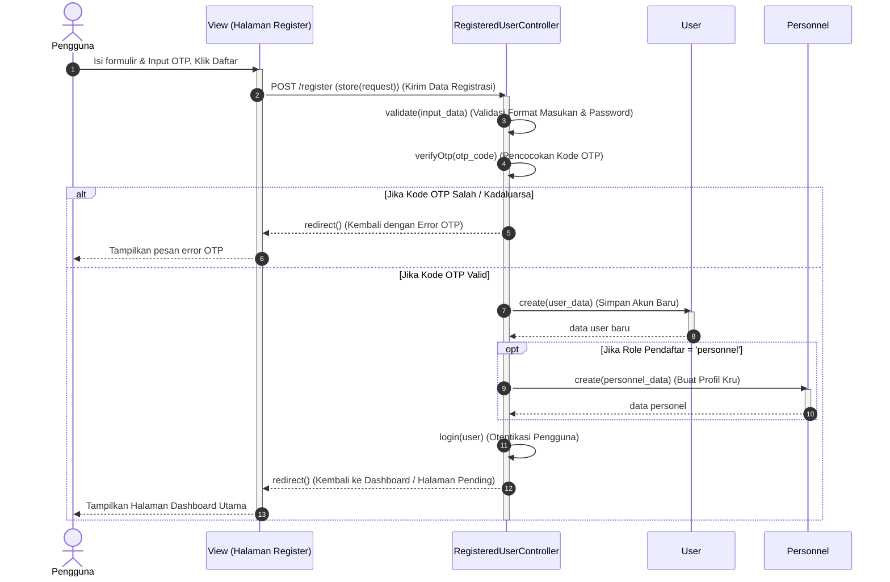

# Sequence Diagram: Register Akun Baru (Aktivitas 20)

Berikut adalah **Sequence Diagram Induk** untuk **Aktivitas 20: Register** yang disusun berdasarkan kode Laravel pada [RegisteredUserController.php](file:///d:/ART-HUB_Sanggar Seni/laravel-app-2/app/Http/Controllers/Auth/RegisteredUserController.php#L31). Diagram ini disederhanakan hanya menggunakan objek **View, Controller, dan Model** (menghilangkan cache/mail driver agar fokus ke MVC).

---

## 1. Diagram (Mermaid)



---

## 2. Keterangan Setiap Garis (Untuk Salin-Tempel ke StarUML)

Berikut adalah daftar teks keterangan garis untuk disalin langsung ke StarUML:

### A. Alur Validasi Awal
1. **Pengguna $\rightarrow$ View (Halaman Register)**
   * Tipe: Sinkron
   * Teks: `Isi formulir & Input OTP, Klik Daftar`
2. **View (Halaman Register) $\rightarrow$ RegisteredUserController**
   * Tipe: Sinkron
   * Teks: `POST /register (store(request)) (Kirim Data Registrasi)`
3. **RegisteredUserController $\rightarrow$ RegisteredUserController (Self)**
   * Tipe: Mandiri
   * Teks: `validate(input_data) (Validasi Format Masukan & Password)`
4. **RegisteredUserController $\rightarrow$ RegisteredUserController (Self)**
   * Tipe: Mandiri
   * Teks: `verifyOtp(otp_code) (Pencocokan Kode OTP)`

### B. Cabang 1: OTP Salah / Kadaluarsa (Kotak `alt` Atas)
5. **RegisteredUserController $\rightarrow$ View (Halaman Register)**
   * Tipe: Balasan
   * Teks: `redirect() (Kembali dengan Error OTP)`
6. **View (Halaman Register) $\rightarrow$ Pengguna**
   * Tipe: Balasan
   * Teks: `Tampilkan pesan error OTP`

### C. Cabang 2: OTP Valid (Kotak `alt` Bawah)
7. **RegisteredUserController $\rightarrow$ User (Model)**
   * Tipe: Sinkron
   * Teks: `create(user_data) (Simpan Akun Baru)`
8. **User (Model) $\rightarrow$ RegisteredUserController**
   * Tipe: Balasan
   * Teks: `data user baru`

### D. Di dalam Cabang 2 (Kotak `opt` - Jika Role = 'personnel')
9. **RegisteredUserController $\rightarrow$ Personnel (Model)**
   * Tipe: Sinkron
   * Teks: `create(personnel_data) (Buat Profil Kru)`
10. **Personnel (Model) $\rightarrow$ RegisteredUserController**
    * Tipe: Balasan
    * Teks: `data personel`

### E. Akhir Proses & Redirect
11. **RegisteredUserController $\rightarrow$ RegisteredUserController (Self)**
    * Tipe: Mandiri
    * Teks: `login(user) (Otentikasi Pengguna)`
12. **RegisteredUserController $\rightarrow$ View (Halaman Register)**
    * Tipe: Balasan
    * Teks: `redirect() (Kembali ke Dashboard / Halaman Pending)`
13. **View (Halaman Register) $\rightarrow$ Pengguna**
    * Tipe: Balasan
    * Teks: `Tampilkan Halaman Dashboard Utama`

---

## 3. Pemetaan Kode PHP Ke Diagram

* **Langkah 3 (Validasi)** memetakan baris 34–40:
  ```php
  $request->validate([
      'name' => ['required', 'string', 'max:255', 'regex:/^[a-zA-Z\s\.]+$/'],
      'email' => ['required', 'string', 'lowercase', 'email', 'max:255', 'unique:'.User::class],
      ...
  ]);
  ```
* **Langkah 4 (Cek OTP)** memetakan baris 48–63:
  ```php
  if (!$cachedOtp || $cachedOtp !== $request->otp_code) { ... }
  ```
* **Langkah 7 (Simpan User)** memetakan baris 72–79:
  ```php
  $user = User::create([ ... ]);
  ```
* **Langkah 9 (Simpan Personnel)** memetakan baris 81–94:
  ```php
  if ($role === 'personel') {
      \App\Models\Personnel::create([ ... ]);
  }
  ```
* **Langkah 11 (Login)** memetakan baris 98:
  ```php
  Auth::login($user);
  ```
