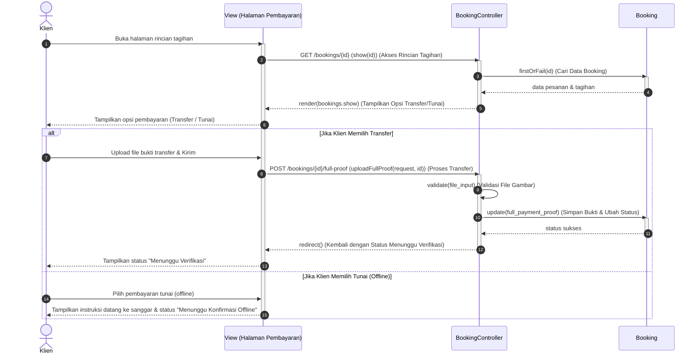

# Sequence Diagram: Pembayaran Tagihan (Aktivitas 21)

Berikut adalah **Sequence Diagram Induk** untuk **Aktivitas 21: Pembayaran Tagihan** yang disusun agar sesuai dengan alur *Activity Diagram* yang Anda berikan, serta disederhanakan hanya menggunakan 3 objek utama (**View, Controller, Model**) sesuai instruksi dosen Anda.

---

## 1. Diagram (Mermaid)



---

## 2. Keterangan Setiap Garis (Untuk Salin-Tempel ke StarUML)

Berikut adalah teks garis yang bisa Kakak salin langsung ke StarUML:

### A. Alur Awal (Mengakses Rincian & Tagihan)
1. **Klien $\rightarrow$ View (Halaman Pembayaran)**
   * Tipe: Sinkron
   * Teks: `Buka halaman rincian tagihan`
2. **View (Halaman Pembayaran) $\rightarrow$ BookingController**
   * Tipe: Sinkron
   * Teks: `GET /bookings/{id} (show(id)) (Akses Rincian Tagihan)`
3. **BookingController $\rightarrow$ Booking (Model)**
   * Tipe: Sinkron
   * Teks: `firstOrFail(id) (Cari Data Booking)`
4. **Booking (Model) $\rightarrow$ BookingController**
   * Tipe: Balasan
   * Teks: `data pesanan & tagihan`
5. **BookingController $\rightarrow$ View (Halaman Pembayaran)**
   * Tipe: Balasan
   * Teks: `render(bookings.show) (Tampilkan Opsi Transfer/Tunai)`
6. **View (Halaman Pembayaran) $\rightarrow$ Klien**
   * Tipe: Balasan
   * Teks: `Tampilkan opsi pembayaran (Transfer / Tunai)`

### B. Sekat Atas (Kondisi 1: Jika Klien Memilih Transfer)
7. **Klien $\rightarrow$ View (Halaman Pembayaran)**
   * Tipe: Sinkron
   * Teks: `Upload file bukti transfer & Kirim`
8. **View (Halaman Pembayaran) $\rightarrow$ BookingController**
   * Tipe: Sinkron
   * Teks: `POST /bookings/{id}/full-proof (uploadFullProof(request, id)) (Proses Transfer)`
9. **BookingController $\rightarrow$ BookingController (Self)**
   * Tipe: Mandiri
   * Teks: `validate(file_input) (Validasi File Gambar)`
10. **BookingController $\rightarrow$ Booking (Model)**
    * Tipe: Sinkron
    * Teks: `update(full_payment_proof) (Simpan Bukti & Ubah Status)`
11. **Booking (Model) $\rightarrow$ BookingController**
    * Tipe: Balasan
    * Teks: `status sukses`
12. **BookingController $\rightarrow$ View (Halaman Pembayaran)**
    * Tipe: Balasan
    * Teks: `redirect() (Kembali dengan Status Menunggu Verifikasi)`
13. **View (Halaman Pembayaran) $\rightarrow$ Klien**
    * Tipe: Balasan
    * Teks: `Tampilkan status "Menunggu Verifikasi"`

### C. Sekat Bawah (Kondisi 2: Jika Klien Memilih Tunai / Offline)
14. **Klien $\rightarrow$ View (Halaman Pembayaran)**
    * Tipe: Sinkron
    * Teks: `Pilih pembayaran tunai (offline)`
15. **View (Halaman Pembayaran) $\rightarrow$ Klien**
    * Tipe: Balasan
    * Teks: `Tampilkan instruksi datang ke sanggar & status "Menunggu Konfirmasi Offline"`

---

## 3. Pemetaan Kode PHP Ke Diagram

* **Langkah 2 (Akses Rincian)** memetakan baris 112–116 di [BookingController.php](file:///d:/ART-HUB_Sanggar Seni/laravel-app-2/app/Http/Controllers/Klien/BookingController.php#L112):
  ```php
  public function show($id)
  {
      $booking = Booking::where('id', $id)->where('client_id', Auth::id())->firstOrFail();
      return view('klien.bookings.show', compact('booking'));
  }
  ```
* **Langkah 8 (Proses Transfer / Pelunasan)** memetakan baris 143–163 di [BookingController.php](file:///d:/ART-HUB_Sanggar Seni/laravel-app-2/app/Http/Controllers/Klien/BookingController.php#L143):
  ```php
  public function uploadFullProof(Request $request, $id)
  {
      $booking = Booking::where('id', $id)->where('client_id', Auth::id())->firstOrFail();
      ...
      $request->validate([ ... ]);
      ...
      $booking->update([ 'full_payment_proof' => $path ]);
      ...
  }
  ```
* **Langkah 15 (Tunai / Offline)** memetakan tampilan instruksi pembayaran tunai (HTML) di view [show.blade.php](file:///d:/ART-HUB_Sanggar Seni/laravel-app-2/resources/views/klien/bookings/show.blade.php) saat klien tidak mengunggah bukti, menunggu konfirmasi manual oleh admin.
